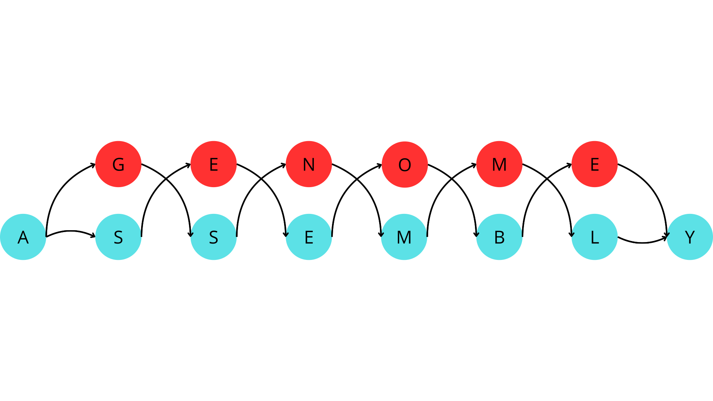
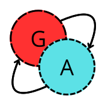

<p align="center">
  
</p>
<p align="center">
	<em><code>❯ "RECONSTRUCCIÓN DE GENOMAS MEDIANTE ENSAMBLADO DE GRAFOS" STEMBach project.</code></em>
</p>

<p align="center">
	
	
	
</p>
<p align="center"><!-- default option, no dependency badges. -->
</p>
<p align="center">
<!-- default option, no dependency badges. -->
</p>
<br>


##  Getting Started
<p align="center">
  
</p>

###  Prerequisites

Before getting started with genomeAssembly, ensure your runtime environment meets the following requirements:

- **Programming Language:** Python 3.13 was the one used during developement. Other versions supporting the dependencies may also work (As far as tested maximum version is 3.13). You can check your current python version with:
```sh
python --version
```
It should give an output such as:
```sh
Python 3.13.12
```
- **Package Manager:** Used pip for dependencies installation. Other alternatives may also work.

It is highly recommended to use a virtual environment to avoid any package conflicts.

###  Installation

You can install genomeAssembly using one of the following methods:

**Build from source:**

1. Clone the genomeAssembly repository
2. Navigate to the project directory
3. Install the project dependencies

All this steps can be performed by this series of commands:
```sh
git clone https://github.com/AntonFerreiro/genomeAssembly
cd genomeAssembly
python -m pip install -r requirements.txt
```


###
**Through the [releases](https://github.com/AntonFerreiro/genomeAssembly/releases) tab (recommended):**

1. Download the **latest stable release** and **extract it**.
2. Navigate to the extracted directory.
3. Install the project **dependencies**:

```sh
python -m pip install -r requirements.txt
```


###  Usage
Once downloaded and with the dependencies satisfied, place your genome sample on `Muestras/muestra.txt` or give the path through command line arguments.

Execute `genomeAssembly.py` on a terminal.

```sh
python genomeAssembly.py
```

 It will execute every file in `Scripts/` to read the sample.
 
 `DIVIDIR.py`: Divides the sample (`Muestras/muestra.txt`) in **'k' bases per fragment**. Then **shuffles the fragments** unless `-n / --noshuffle` argument is provided.

 `ENSAMBLADO.py`: Tries to reconstruct the original sample through the divided one using **De Bruijn graphs** via an **Eulerian path**

`COMPARAR.py`: Compares both **original and reconstructed samples** in order to give an accurracy ratio.

`SÍNTESIS.py`: This is an **extra script**. It translates each **ADN** fragment to **ARN** to then translate them to **proteins**.

```sh
usage: genomeAssembly.py [-h] [-v] [-p PARTS] [-n]

[GENOME RECONSTRUCTION VIA GRAPH ASSEMBLY PIPELINE]

options:
  -h, --help         show this help message and exit
  -v, --verbose      shows detailed output (log file is always verbose).
  -p, --parts PARTS  number of bases per fragment. This is the 'k' length (if not specified, must be given through input)
  -n, --noshuffle    prevents [DIVIDIR.py] from shuffling the sample. Intended only for debugging purposes.

Parameters such as [PARTS] will be asked through input if not specified.
```

A correct execution should give an output like this:

```sh
<PATH\TO\genomeAssembly-XX.x\> PATH\TO\genomeAssembly-XX.x\genomeAssembly.py -p 10
2026-03-14 13:33:49,462 | INFO | >> Executing DIVIDIR.py
2026-03-14 13:33:49,532 | INFO | >> Executing ENSAMBLADO.py
2026-03-14 13:33:51,241 | INFO | >> Executing COMPARAR.py
2026-03-14 13:33:51,312 | INFO | >> Executing SÍNTESIS.py
2026-03-14 13:33:51,369 | INFO | [OK] Pipeline completed succesfully. Logs are located in logs/log.txt // Results are located in Resultados/
```
Using `-v / --verbose` will give a detailed output as seen in logs.

---

##  License

This project is protected under the [LGPLv3](https://www.gnu.org/licenses/gpl-3.0.en.html) License. For more details, refer to the [COPYING](https://github.com/AntonFerreiro/genomeAssembly/blob/main/COPYING) and [COPYING.LESSER](https://github.com/AntonFerreiro/genomeAssembly/blob/main/COPYING.LESSER) files.

---

